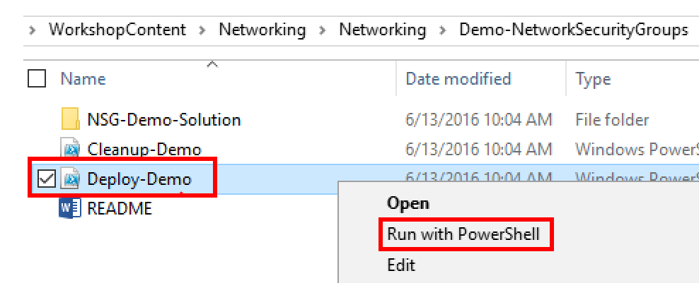
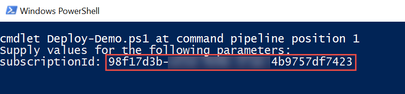
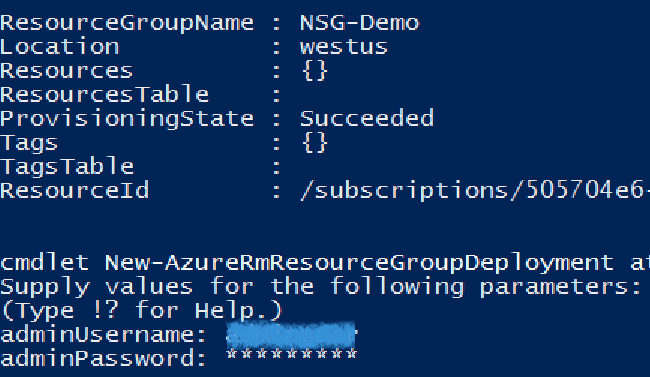
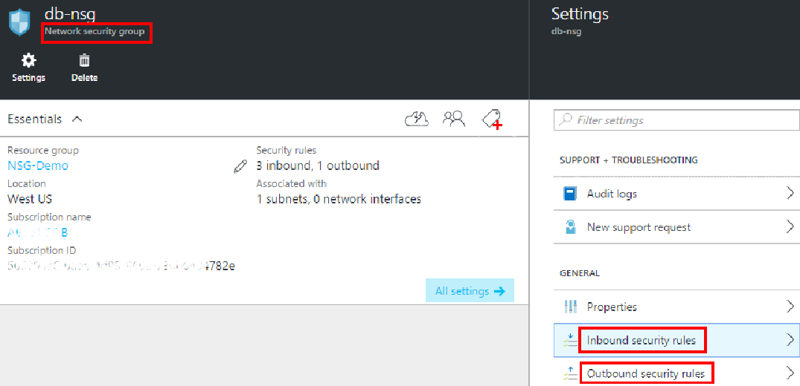
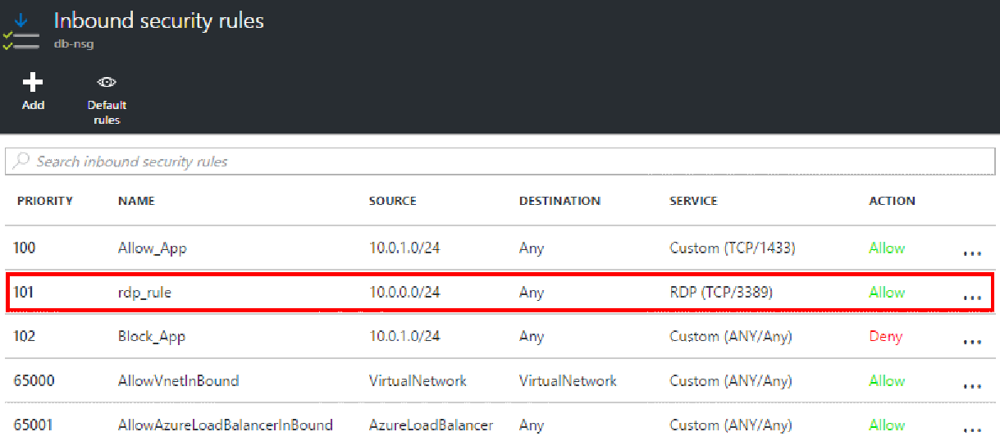
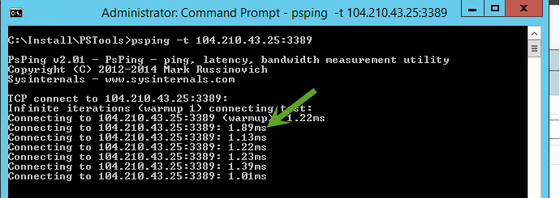
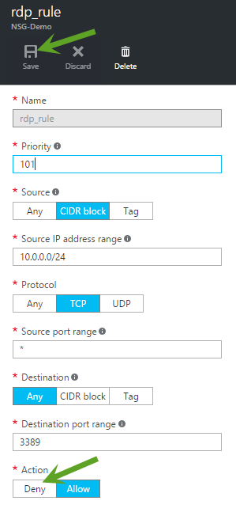
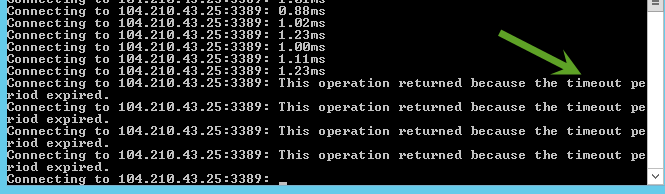

Network Security Group
======================

This guide demonstrates how to create Network Security Group to secure your workload in the Azure. In this demonstration you will show how to

-   Configure a Network Security Group in a Subnet

-   Observe how NSG blocking the traffic on applying denying rule on one of the port

Pre-requisites
--------------

This demonstration requires the following:

-   Azure Subscription

-   PSTool ([download here](https://technet.microsoft.com/en-us/sysinternals/jj729731.aspx))

-   Set the Windows PowerShell execution policy on your machine to RemoteSigned if it is not already set.

-   Set-ExecutionPolicy -ExecutionPolicy RemoteSigned -Force

Setup
-----

*Estimated Time: 15 minutes (mostly waiting for the ARM template to deploy)*

1.  Open Windows Explorer and navigate to the **Networking/Demo-NetworkSecurityGroups** folder.

2.  Right-click on **Deploy-Demo.ps1** and select **Run with PowerShell**. *Note: You can run the script from the PowerShell ISE if you prefer. Either way will work the same.*

> 

1.  The script requires one parameter, your Azure Subscription ID, which you can get from the Subscriptions blade in the Azure portal. Paste your Subscription ID (without quotes) when prompted and press **ENTER**.

> 

1.  Authenticate to your Azure subscription using your Azure credentials.

2.  When prompted to, enter an admin username and password. These are the credentials you will use to sign-in to the virtual machines that are provisioned by the ARM template.

> 
>
> Wait for the deployment to finish before proceeding to the next step.

1.  Sign-in to **fe-vm** virtual machine using the adminuser and password you entered in the previous step. *Hint: Click the **Connect** button in the virtual machine blade for **fe-vm** in the Azure portal.*

    1.  Open Windows File Explorer and navigate to C:\\\\Install.

    2.  Unzip “PSTools”.

-   Keep your RDP session to this virtual machine open. You will come back to it in the demo.

Demo Steps
----------

*Estimated Time: 5 minutes*

1.  Sign-in to the Azure portal.

2.  Open the **NSG-Demo** resource group blade.

3.  Identify the resources in the resource group that make up the demo. At a high level, what you are going to show is that how NSG blocking the traffic on applying denying rule on one of the port.

    1.  The 3 virtual machines.

    2.  The 3 virtual NIC's that bind each of the virtual machines to the virtual network.

    3.  The 3 public IP addresses which are there only so we can RDP into the VM's.

    4.  The virtual network.

    5.  The 3 network security group for 3 subnets.

<!-- -->

1.  Open the **NSG** blade and show that the “dbnsg” has an Inbound and Outbound rules.

> 
>

1.  Explain NSG security rule configuration details.

> 

1.  Open the RDP connection to **fe-vm**.

<!-- -->

1.  Go to the “PSTool” folder (C:\\\\Install\\PSTools) location using command prompt (Administrator). Execute below command:

> **psping -t &lt;&lt;db-vm public ip address&gt;&gt;:&lt;&lt;Port Number&gt;&gt;**

1.  You will get the response from the server.

    

<!-- -->

1.  Open the **NSG-Demo** resource group blade. Select the database NSG rule (e.g. dbnsg) and click on settings &gt; you should be able to see the Inbound rule “**rdp\_rule**” which allows traffic on port 3389.

2.  Select the rule and change the Action to the “Deny” from “Allow”.

> 

1.  After denying incoming traffic on port 3389 on db server, you will receive time out response. **(note: wait for a minute to rule to take effect)**

> 

Cleanup
-------

*Estimated Time: 5 minutes*

1.  Open Windows Explorer and navigate to the **Networking/ Demo-NetworkSecurityGroups** folder.

2.  Right-click on **Cleanup-Demo.ps1** and select **Run with PowerShell**. *Note: You can run the script from the PowerShell ISE if you prefer. Either way will work the same.*

-   The script requires one pasrameter which is your Azure Subscription ID. *Note: If you changed the resource group name when you ran the Deploy-Demo script during setup, then make sure you supply the new resource group name you used. Otherwise, the default resource group name is assumed.*
