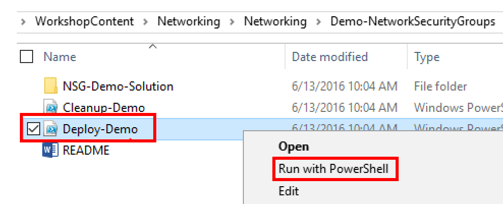
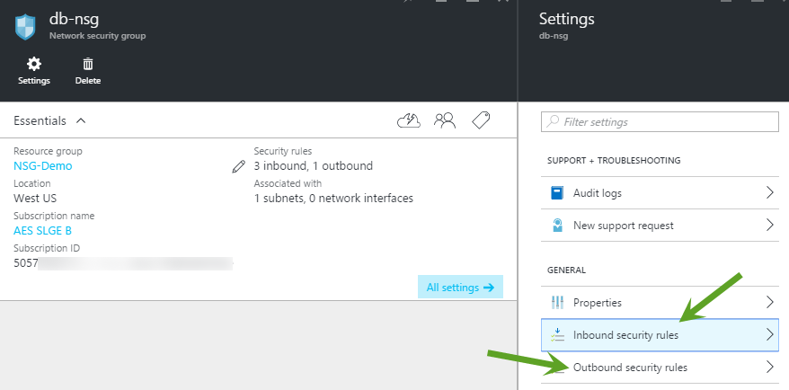
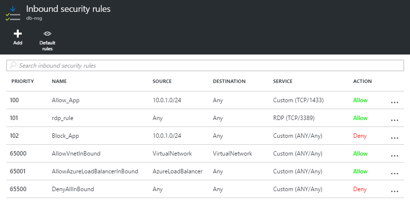
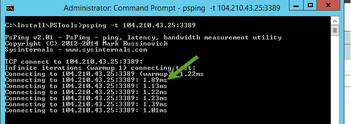
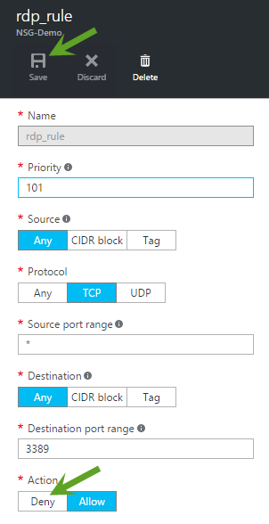
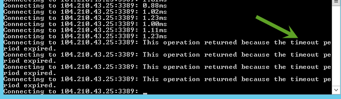

#Network Security Group

This guide demonstrates how to create a Network Security Group (NSG) to secure your workload in the Azure. In this demonstration, you will show how to

* Configure a Network Security Group in a subnet
* Observe how a NSG deny-rule blocks inbound traffic to a virtual machine

##Pre-requisites

This demonstration requires the following:

* Azure Subscription
* Azure PowerShell Cmdlets v1.4.0 or later ([download here](http://aka.ms/webpi-azps))
* Set the Windows PowerShell execution policy on your machine to RemoteSigned if it is not already set.
 * ` Set-ExecutionPolicy -ExecutionPolicy RemoteSigned -Force `

##Setup

_Estimated Time: 10 minutes_

1. Open Windows Explorer and navigate to the **Networking/Demo-NetworkSecurityGroups** folder.

2. Right-click on **Deploy-Demo.ps1** and select **Run with PowerShell**. *Note: You can run the script from the PowerShell ISE if you prefer. Either way will work the same.*
    

3. The script requires one parameter, your Azure Subscription ID, which you can get from the Subscriptions blade in the Azure portal. Paste your Subscription ID (without quotes) when prompted and press **ENTER**.
    

4. Authenticate to your Azure subscription using your Azure credentials.

5. When prompted to, enter an admin username and password. These are the credentials you will use to sign-in to the virtual machines that are provisioned by the ARM template.
    

    Wait for the deployment to finish before proceeding to the next step.

6. Sign-in to **fe-vm** virtual machine using the adminuser and password you entered in the previous step. *Hint: Click the **Connect** button in the virtual machine blade for **fe-vm** in the Azure portal.*

    a. Open Windows File Explorer and navigate to the directory **C:\Install**.

    b. Unzip **PSTools.zip**.

_Note: Keep your RDP session to this virtual machine open. You will come back to it in the demo._

##Demo Steps
_Estimated Time: 5 minutes_

1. Sign-in to the Azure portal.

2. Open the **NSG-Demo** resource group blade.

3. Identify the resources in the resource group that make up the demo. At a high level, what you are going to show is that how NSG blocking the traffic on applying denying rule on one of the port.  

    a. The 3 virtual machines.

    b. The 3 virtual NIC's that bind each of the virtual machines to the virtual network.

    c. The 3 public IP addresses which are there only so we can RDP into the VM's.

    d. The virtual network.

    e. The 3 network security group for 3 subnets.

4. Open the **NSG** blade and show that the **dbnsg** has an Inbound and Outbound rules.

    

5.	Explain NSG security rule configuration details.

    

6. Open the RDP connection to **fe-vm**.

7. Open a command prompt (as Administrator) and change directory to **C:\Install\PSTools**. 

    a.  Execute the following command: **psping -t [db-vm public ip address]:3389**

    b. You will get a response from the server as shown here.

    

8. Open the **NSG-Demo** resource group blade. Select the database NSG rule (e.g. dbnsg) and click on **Settings**.

9. Select the Inbound rule **rdp_rule** that currently allows traffic on port 3389.

    a. Change the **Action** for the rule to **Deny**

    b. Click **Save** to save the changes.

    

10.	Go back to the RDP connection to the **fe-vm**.

11. Notice the psping is timing out in the response. _Note: It may take a few seconds for the rule change to take effect._

    

##Cleanup
_Estimated Time: 5 minutes_

1. Open Windows Explorer and navigate to the **Networking/ Demo-NetworkSecurityGroups** folder.

2. Right-click on **Cleanup-Demo.ps1** and select **Run with PowerShell**.  _Note: You can run the script from the PowerShell ISE if you prefer. Either way will work the same._

    The script requires one parameter which is your Azure Subscription ID.  _Note: If you changed the resource group name when you ran the Deploy-Demo script during setup, then make sure you supply the new resource group name you used.  Otherwise, the default resource group name is assumed._     

