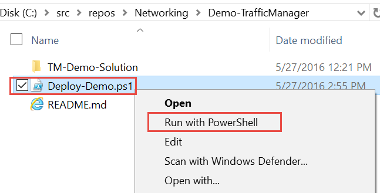
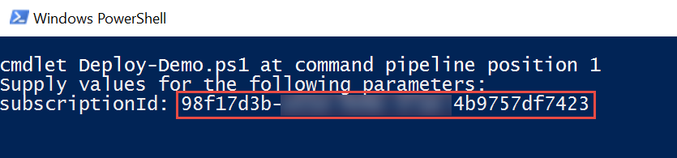

# Traffic Manager
***

This guide demonstrates how to use Azure Traffic Manager to globally scale a web app.  In this demonstration you will show how to

* Create a Traffic Manager profile using the Weighted (round-robin) routing method
* Configure endpoints for the profile
* Observe how Traffic Manager resolves DNS names when you stop and start web apps
* Configure Traffic Manager profile settings

## Pre-requisites
***

This demonstration requires the following:

* Azure Subscription
* Azure PowerShell Cmdlets v1.4.0 or later ([download here](http://aka.ms/webpi-azps))
* Set the Windows PowerShell execution policy on your machine to RemoteSigned if it is not already set.
 * ` Set-ExecutionPolicy -ExecutionPolicy RemoteSigned -Force `

## Setup
***

_Estimated Time: 5 minutes_

1. Open Windows Explorer and navigate to the **Networking/Demo-TrafficManager** folder.

2. Right-click on **Deploy-Demo.ps1** and select **Run with PowerShell**.  _Note: You can run the script from the PowerShell ISE if you prefer. Either way will work the same._
    

3. The script requires one parameter, your Azure Subscription ID, which you can get from the Subscriptions blade in the Azure portal.  Paste your Subscription ID (without quotes) when prompted and press **ENTER**.
    

## Demo Steps
***
_Estimated Time: 15 minutes_

// TODO

## Cleanup
***
_Estimated Time: 5 minutes_

1. Open Windows Explorer and navigate to the **Networking/Demo-TrafficManager** folder.

2. Right-click on **Cleanup-Demo.ps1** and select **Run with PowerShell**.  _Note: You can run the script from the PowerShell ISE if you prefer. Either way will work the same._

3. The script requires one parameter which is your Azure Subscription ID.  _Note: If you changed the resource group name during setup then make sure you supply the resource group name you used.  Otherwise, the default resource group name is assumed._     

