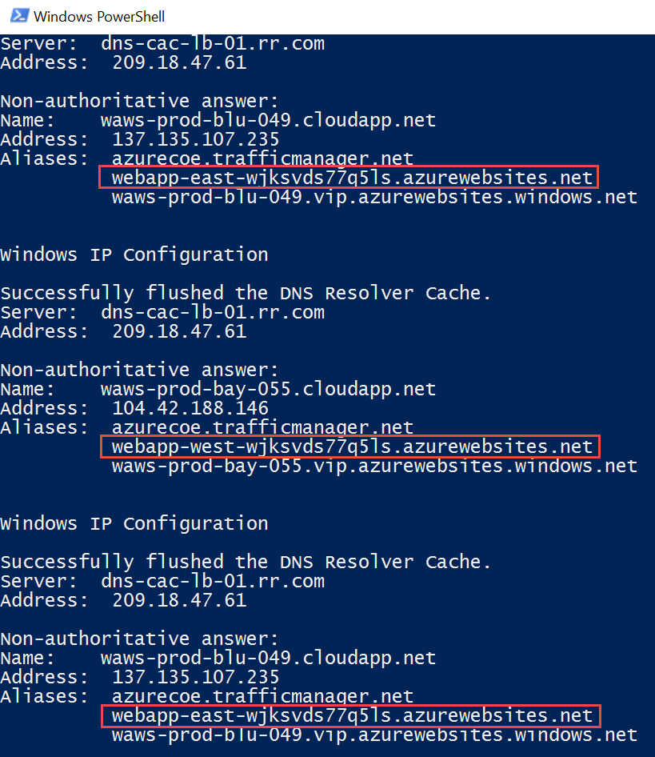

#Traffic Manager
***

This guide demonstrates how to use Azure Traffic Manager to globally scale a web app.  In this demonstration you will show how to

* Create a Traffic Manager profile using the Weighted (round-robin) routing method
* Configure endpoints for the profile
* Observe how Traffic Manager resolves DNS names when you stop and start web apps
* Configure Traffic Manager profile settings

##Pre-requisites
***

This demonstration requires the following:

* Azure Subscription
* Azure PowerShell Cmdlets v1.4.0 or later ([download here](http://aka.ms/webpi-azps))
* Set the Windows PowerShell execution policy on your machine to RemoteSigned if it is not already set.
 * ` Set-ExecutionPolicy -ExecutionPolicy RemoteSigned -Force `

##Setup
***

_Estimated Time: 5 minutes_

1. Open Windows Explorer and navigate to the **Networking/Demo-TrafficManager** folder.

2. Right-click on **Deploy-Demo.ps1** and select **Run with PowerShell**.  _Note: You can run the script from the PowerShell ISE if you prefer. Either way will work the same._
    

3. The script requires one parameter, your Azure Subscription ID, which you can get from the Subscriptions blade in the Azure portal.  Paste your Subscription ID (without quotes) when prompted and press **ENTER**.
    

4. Authenticate to your Azure subscription using your Azure credentials.

##Demo Steps
***
_Estimated Time: 15 minutes_

1. Sign-in to the Azure portal.

2. Open the **TM-Demo** resource group blade.

3. In the Resources tile, click on **WebApp-West-xyz**.  

4. Click the **Browse** button in the toolbar at the top of the blade.  Show what the app does, which is nothing more than outputting the region it is running in.  This app is in West US.

    Note: Web Apps have environment variables that you can access from within the application.  One environment variable is called REGION_NAME.  All this app does is retrieve the REGION_NAME environment variable from the web app environment and display it on the page.

    

4.	Repeat for WebApp-East-xyz to show it is running in East US.

5. Go back to the Azure portal.

6. Select **+NEW** > **Networking** > **Traffic Manager profile**.

    a. Enter a unique DNS Name for the traffic manager profile.  Try to keep it short so you can invite the audience to access it later.

    b. Set the Routing Method to **Weighted**. 

    c. Set the Resource Group to **TM-Demo**.

    d. Set the Location to **West US**.

    e. Click **Create**.

    

    While the profile is being created, which should only take a few seconds, explain the different [Routing Methods](https://azure.microsoft.com/en-us/documentation/articles/traffic-manager-routing-methods/) (performance, weighted, priority).

7. Open the Traffic Manager profile blade and point out the **DNS name** and the **Endpoints** tile (which is empty).  Click on the **DNS name** to show it does not resolve to any applications yet.

9.	In the Traffic Manager profile blade, click on the **Endpoints** web part.

10.	In the Endpoints blade, click the **Add** button in the toolbar.

    a. Set the **Type** to **Azure endpoint**.

    b. Set the **Name** to **East EP**.

    c. Set the **Target Resource Type** to **App Service**.

    d. Set the **Target Resource** to **WebApp-East-xyz**.

    e. Set the **Weight** to 1.

    f. Click **OK**.

    

11. Repeat the previous steps to add a 2nd endpoint where the **Name** is **West EP** with the **Target Resource** is **WebApp-West-xyz**.

    

12. In the Traffic Manager profile blade, click **Settings** > **Configuration**.

13. In the Configuration blade, set **DN time to live (TTL)** to **30** seconds and click **Save**.

    

    For the **Endpoint monitoring settings**, explain that by default Traffic Manager makes an HTTP GET request to the root of the web app.  If it gets HTTP 200 back, then it assumes it is healthy.  A best practice is instead to have a "healthcheck" page in the app and set the **Path** to the URL for that page for Traffic Manager to call.  The healthcheck page in the app should perform deeper validation (check DB connections, web service dependencies, etc.) and return an HTTP 500 if it is not able to verify all the resources the app needs are available.

    Before proceeding make sure the two endpoints are **Enabled** and **Online** as shown in the Endpoints blade. 

14. Open Windows Explorer and navigate to the **Networking/Demo-TrafficManager** folder.
 
15. Right-click on **Test-TrafficManager.ps1** and select **Run with PowerShell**.

    The script performs an nslookup every 10 seconds and flushes the DNS cache.  You should see that that the DNS name for the Traffic Manager profile is resolving to the **East EP** and **West EP** in a round-robin fashion.

    _Note: It's possible that you may see the URL resolve to the same web app a couple of times if other requests to the traffic manager profile are occurring.  For example, people in the audience and traffic manager monitoring requests._

    

    Leave the script running and continue to the next step.

15. Invite the audience (if present) to browse to the DNS name for the traffice manager profile using their cell phone or computer.

    a. Ask for a show of hands that resolved to the **East US** endpoint and again for the **West US** endpoint.  You should get essentially the same number of responses for both.

16. Go back to the Azure portal.

17. Open the **Web App blade** for the **WebApp-East-xyz** web app.

18. Press the **Stop** button in the toolbar.

    

19. Open the **Traffic Manager profile** blade.  

    In the Endpoints tile, you will eventually see the **East EP** transition to a **Degraded** status.  It will take about 90 seconds from the time you stopped the web site for this to occur.  While you are waiting for this to occur, explain what is happening and why it takes ~90 seconds for the endpoint to become degraded.  Details are [here](https://azure.microsoft.com/en-us/documentation/articles/traffic-manager-monitoring/).

    

20. Go back to the Windows PowerShell window where the Test-TrafficManager.ps1 script is running.  Point out that all requests are resolving to the West EP now that the East EP has been degraded in the profile.

    

21. Invite the audience (if present) again to refresh their browsers.  Everyone should resolve to the **West EP**.

22. Go back to the Azure portal.

17. Open the **Web App blade** for the **WebApp-East-xyz** web app.

18. Press the **Start** button in the toolbar.

19. Open the **Traffic Manager profile** blade.

    Point out that it only taks about 10 seconds for Traffic Manager to see the site is back up and to put the endpoint back in rotation.  Make sure to explain the reason why to the audience.

    

20. Go back to the Windows PowerShell window where the Test-TrafficManager.ps1 script is running.  Show that the requests are resolving in round-robin fashion again.

21. Press **CTRL-C** to terminate the script.

##Cleanup
***
_Estimated Time: 5 minutes_

1. Open Windows Explorer and navigate to the **Networking/Demo-TrafficManager** folder.

2. Right-click on **Cleanup-Demo.ps1** and select **Run with PowerShell**.  _Note: You can run the script from the PowerShell ISE if you prefer. Either way will work the same._

3. The script requires one parameter which is your Azure Subscription ID.  _Note: If you changed the resource group name when you ran the Deploy-Demo script during setup, then make sure you supply the new resource group name you used.  Otherwise, the default resource group name is assumed._     

