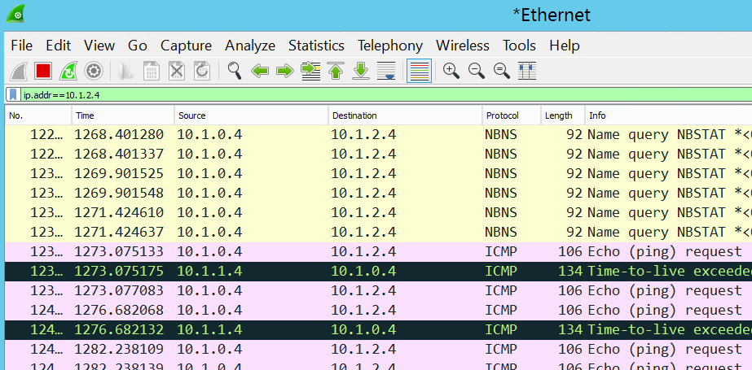

#User Defined Routes

This guide demonstrates how User Defined Routes (UDR) can be used to control the routing of packets through a virtual appliance.  In this demonstration you will show how to 

* Configure a User Defined Route in a virtual network
* Configure a virtual appliance to route traffic through
* Observe UDR route traffic (the next hop) for packets going through the virtual appliance using WireShark 

##Pre-requisites

This demonstration requires the following:

* Azure Subscription
* Azure PowerShell Cmdlets v1.4.0 or later ([download here](http://aka.ms/webpi-azps))
* Set the Windows PowerShell execution policy on your machine to RemoteSigned if it is not already set.
 * ` Set-ExecutionPolicy -ExecutionPolicy RemoteSigned -Force `

##Setup

_Estimated Time: 25 minutes (mostly waiting for the ARM template tp deploy)_

1. Open Windows Explorer and navigate to the **Networking/Demo-UserDefinedRoutes** folder.

2. Right-click on **Deploy-Demo.ps1** and select **Run with PowerShell**.  _Note: You can run the script from the PowerShell ISE if you prefer. Either way will work the same._
    

3. The script requires one parameter, your Azure Subscription ID, which you can get from the Subscriptions blade in the Azure portal.  Paste your Subscription ID (without quotes) when prompted and press **ENTER**.
    

4. Authenticate to your Azure subscription using your Azure credentials.

5. When prompted to, enter an admin username and password.  These are the credentials you will use to sign-in to the virtual machines that are provisioned by the ARM template.

    

    Wait for the deployment to finish before proceeding to the next step.
6. Sign-in to **vm-1** using the adminuser and password you entered in the previous step.  _Hint: Click the **Connect** button in the virtual machine blade for **vm-1** in the Azure portal._

    a. Open Windows File Explorer and navigate to C:\Install.

    b. Double-click on WinPcap_4_1_3.exe to start the WinPcap installation.

    

    Note: It is not possible to automate the installation of WinPcap, which installs the drivers used by WireShark to monitor network traffic.  Hence the reason for this manual step.

    c. In the WinPcap setup window, accept all the defaults and click **Install**.

    

    d. Close Windows File Explorer.

    Keep your RDP session to this virtual machine open.  You will come back to it in the demo.

7. Sign-in to **vm-0** using the same adminuser and password you entered in the previous step.  Keep your RDP session to this virtual machine open.  You will come back to it in the demo.

##Demo Steps
_Estimated Time: ?? minutes_

1. Sign-in to the Azure portal.

2. Open the **UDR-Demo** resource group blade.

3. Identify the resources in the resource group that make up the demo.  At a high level, what you are going to show is that traffic from **vm-0** that is addressed to **vm-2** will pass through **vm-1** (the virtual appliance).

    a. The 3 virtual machines.

    b. The 3 virtual NIC's that bind each of the virtual machines to the virtual network.

    c. The 3 public IP addresses which are there only so we can RDP into the VM's

    d. The virtual network.

    e. The user defined route / route-table.

4. Click on the virtual network resource and show 3 NIC's that bind the VM's to the different subnets.  Explain that these are the internal IP addresses assigned to the NIC's and therefore the virtual machine they are bound to.

    

5. Go the **Subnets** blade and show that the FrontendSubnet has a route table assigned to it.  The other two subnets do not.
 
    

6. Open the **Route table** blade.  Show how traffic from VM's in the FrontendSubnet to VM's in the BackendSubnet is routed through the VM Appliance at 10.1.1.4. 

    

7. Click on the virtual appliance route in the Routes tile.

8. In the **Edit route** blade, show where the **Next hop type** is set to **Virtual Appliance**.  Explain the other options in the Next hop type dropdown ([details here](herehttps://azure.microsoft.com/en-us/documentation/articles/virtual-networks-udr-overview)).

9. Open the RDP connection to **vm-1** (the VM Appliance).

10.	Double-click on the **Wireshark** icon on the desktop.

    a. Double-click on the Ethernet graph.

    

    b. In the filter field under the toolbar, set the filter to **ip.addr==10.1.2.4** (vm-2).  Explain that what we're doing is listening for any traffic that is addressed to and from vm-2 that is in the BackendSubnet.

    

11. Open the RDP connection to **vm-0**.

    a. Open a Command prompt window.

    b. Type tracert 10.1.2.4 and press ENTER.  Point out that the trace to 10.1.2.4 (vm-2) passed through 10.1.1.4 (vm-1 / the VM Appliance).

    

12. Open the RDP connection to **vm-1**.  Show that this VM (the VM Appliance) is receiving the traffic between 10.1.0.4 (vm-0) and 10.1.2.4 (vm-2).

    

13. Wrap up the demo explaining that for this to work this virtual machine (vm-1) had to have **ipForwarding** enabled and have the **Routing and Remote Access feature installed and configured for Lan Routing**.

    The **ipForwarding** is enabled on the NIC for vm-1.  You can see this in the ARM deployment template.

    

    The Routing and Remote Access installation and configuration is applied via Desired State Configuration (DSC).  See vm-1extenstionConfiguration.ps1 in the solution source code.

    

##Cleanup
_Estimated Time: 5 minutes_

1. Open Windows Explorer and navigate to the **Networking/Demo-UserDefinedRoutes** folder.

2. Right-click on **Cleanup-Demo.ps1** and select **Run with PowerShell**.  _Note: You can run the script from the PowerShell ISE if you prefer. Either way will work the same._

    The script requires one parameter which is your Azure Subscription ID.  _Note: If you changed the resource group name when you ran the Deploy-Demo script during setup, then make sure you supply the new resource group name you used.  Otherwise, the default resource group name is assumed._     

