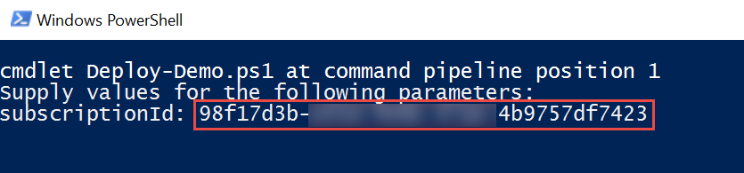

#User Defined Routes

This guide demonstrates how User Defined Routes (UDR) can be used to control the routing of packets through a virtual appliance.  In this demonstration you will show how to 

* Configure a User Defined Route in a virtual network
* Configure a virtual appliance to route traffic through
* Observe UDR route traffic (the next hop) for packets going through the virtual appliance using WireShark 

##Pre-requisites

This demonstration requires the following:

* Azure Subscription
* Azure PowerShell Cmdlets v1.4.0 or later ([download here](http://aka.ms/webpi-azps))
* Set the Windows PowerShell execution policy on your machine to RemoteSigned if it is not already set.
 * ` Set-ExecutionPolicy -ExecutionPolicy RemoteSigned -Force `

##Setup

_Estimated Time: 25 minutes (mostly waiting for the ARM template tp deploy)_

1. Open Windows Explorer and navigate to the **Networking/Demo-UserDefinedRoutes** folder.

2. Right-click on **Deploy-Demo.ps1** and select **Run with PowerShell**.  _Note: You can run the script from the PowerShell ISE if you prefer. Either way will work the same._
    

3. The script requires one parameter, your Azure Subscription ID, which you can get from the Subscriptions blade in the Azure portal.  Paste your Subscription ID (without quotes) when prompted and press **ENTER**.
    

4. Authenticate to your Azure subscription using your Azure credentials.

5. When prompted to, enter an admin username and password.  These are the credentials you will use to sign-in to the virtual machines that are provisioned by the ARM template.

    

    Wait for the deployment to finish before proceeding to the next step.
6. Sign-in to **vm-1** using the adminuser and password you entered in the previous step.  _Hint: Click the **Connect** button in the virtual machine blade for **vm-1** in the Azure portal._

    a. Open Windows File Explorer and navigate to C:\Install.

    b. Double-click on WinPcap_4_1_3.exe to start the WinPcap installation.

    

    Note: It is not possible to automate the installation of WinPcap, which installs the drivers used by WireShark to monitor network traffic.  Hence the reason for this manual step.

    c. In the WinPcap setup window, accept all the defaults and click **Install**.

    

    d. Close Windows File Explorer.

    Keep your RDP session to this virtual machine open.  You will come back to it in the demo.

7. Sign-in to **vm-0** using the same adminuser and password you entered in the previous step.  Keep your RDP session to this virtual machine open.  You will come back to it in the demo.

##Demo Steps
_Estimated Time: ?? minutes_

// TODO

##Cleanup
_Estimated Time: 5 minutes_

1. Open Windows Explorer and navigate to the **Networking/Demo-UserDefinedRoutes** folder.

2. Right-click on **Cleanup-Demo.ps1** and select **Run with PowerShell**.  _Note: You can run the script from the PowerShell ISE if you prefer. Either way will work the same._

    The script requires one parameter which is your Azure Subscription ID.  _Note: If you changed the resource group name when you ran the Deploy-Demo script during setup, then make sure you supply the new resource group name you used.  Otherwise, the default resource group name is assumed._     

